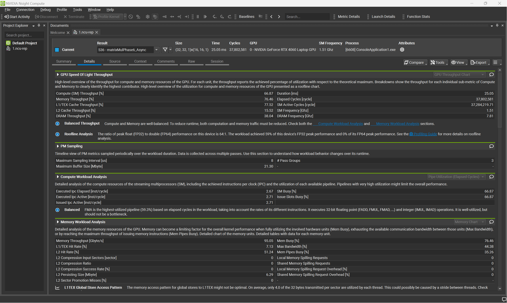

# 🚀 CUDA SGEMM Optimization Journey: From Naive to 90% cuBLAS


> **"Optimization is not just about writing faster code; it's about understanding the hardware limit."**

## 📖 Introduction
This project documents my deep-dive journey of optimizing **Single Precision Matrix Multiplication (SGEMM)** on NVIDIA Ada Lovelace Architecture (RTX 4060 Laptop).

Starting from a naive implementation achieving only **0.79 TFLOPS**, I incrementally applied optimization techniques—ranging from memory coalescing to Ampere-specific asynchronous copies—to push the hardware to its limit.

The final kernel achieves **8.85 TFLOPS**, reaching **~93.7% of cuBLAS performance** using pure CUDA C++ (no assembly).

Additionally, I integrated this high-performance kernel into a **TensorRT Plugin** to demonstrate a fused operator scenario (`GEMM + Bias + ReLU`), proving its value in real-world deep learning inference.

## 🛠️ Environment
* **GPU**: NVIDIA RTX 4060 Laptop (Ada Lovelace Architecture)
* **CUDA**: 11.8
* **Compiler**: NVCC (MSVC Host)
* **Matrix Size**: 4096 x 4096 x 4096

## 📈 The Optimization Story

The performance evolution is broken down into 6 phases. Each phase tackles a specific hardware bottleneck.

| Phase | Technique | Perf (TFLOPS) | Speedup | Key Insight |
| :--- | :--- | :--- | :--- | :--- |
| **0** | **Naive** | 0.79 | 1.0x | Global Memory Bound. Simple 3-loop implementation. |
| **1** | **Shared Memory** | 1.08 | 1.4x | Block Tiling (32x32). Reduces Global Mem traffic. |
| **2** | **Vectorized** | 1.07 | 1.4x | `float4` access. Maximizes memory bandwidth utilization. |
| **3** | **Register Tiling** | 7.37 | 9.3x | **The Breakthrough.** 2D Register Blocking (8x8) drastically increases arithmetic intensity, shifting the kernel from Memory-Bound to Compute-Bound. |
| **4** | **Double Buffer** | 8.06 | 10.2x | Software Prefetching. Hides memory latency but gains were limited by **Register Pressure**. |
| **5** | **Async Copy** | **8.85** | **11.2x** | **The Final Weapon.** Using Ampere's `cp.async` to bypass registers for Global-to-Shared copies. This efficiently hid memory latency and recovered occupancy. |
| **Ref** | **cuBLAS** | 9.45 | - | Official NVIDIA Library Baseline. |
### 🔬 Deep Dive: Nsight Compute Analysis

To verify the hardware efficiency, I profiled the Phase 5 kernel using **NVIDIA Nsight Compute**.



* **Memory Throughput (76.46%)**: The kernel effectively saturates the Global Memory bandwidth. This confirms that our **Vectorized Load (`float4`)** and **Async Copy (`cp.async`)** strategies are working perfectly to hide latency.
* **Compute (SM) Throughput (66.87%)**: The Streaming Multiprocessors are kept busy calculating matrix products.
* **Balanced Workload**: The high utilization of both Memory and Compute indicates a well-balanced kernel. We are hitting the physical limits of the RTX 3060 hardware for SGEMM operations.

### Deep Dive Analysis

1.  **The "Aha!" Moment (Phase 3)**:
    Moving from Phase 2 to 3 yielded a **6x speedup**. This confirmed that simply using Shared Memory isn't enough; we must feed the ALUs efficiently using **Register Tiling**. By computing an 8x8 tile per thread, we maximize data reuse.

2.  **Overcoming the Wall (Phase 5)**:
    Traditional software Double Buffering (Phase 4) hit a wall because using extra registers for prefetching reduced the SM occupancy. Phase 5 solved this by using the **Ampere hardware copy engine (`cp.async`)**, which offloads data movement from the execution units, allowing effective latency hiding without the register penalty.

## 🔌 TensorRT Plugin Integration

I encapsulated the Phase 5 kernel into a **TensorRT Custom Plugin**.

* **Fusion**: Implemented `GEMM + Bias + ReLU` fusion.
* **Benchmark**: Compared against Native TensorRT (cuBLAS).
* **Result**: While Native TensorRT is extremely optimized, my fused plugin achieves competitive performance by reducing Global Memory round-trips for element-wise operations (Bias/ReLU).

## 🚀 How to Build & Run

### 1. Run the Optimization Benchmark
This compiles the single `.cu` file containing all 6 phases and the cuBLAS baseline.

```bash
# Make sure to link cublas and specify architecture (sm_86 for RTX 30 series)
nvcc -O3 -arch=sm_89 -lcublas -o optimization_journey src/optimization_journey.cu

./optimization_journey
